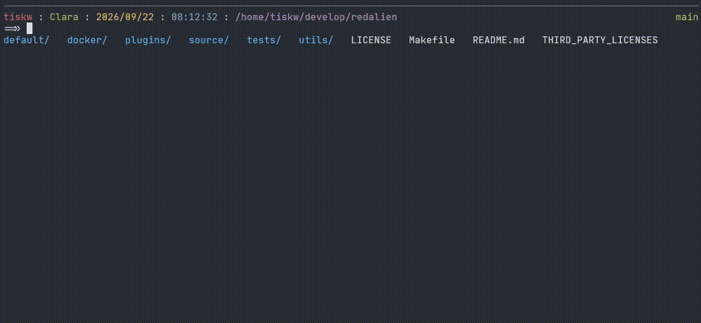

RedAlien - A next-generation command line editor for Bash
====================================================================================================

<p align="center">
  
</p>

<p align="center">
   &nbsp;
   &nbsp;
   &nbsp;
  
</p>

RedAlien is a replacement for the GNU Readline library for [Bash](https://www.gnu.org/software/bash/)
that enhances the command-line experience with real-time syntax highlighting, context-aware completion,
inline file previews, and command history-based input prediction.

<p align="center">
  
</p>

### Motivation

RedAlien is motivated by a simple question:

<p align="center">
  <i>Why is command-line input still limited to plain text typing?</i>
</p>

Modern shells like Bash, Zsh, and fish provide powerful completion systems.
However, the command-line experience still has room for improvement.
For example, consider typing a command like:

```
cat ~/documents/my_project/memo.txt | grep keyword
```

Even with completion, selecting a file path often requires multiple keystrokes or partial typing.
In practice, developers frequently rely on interactive tools such as fuzzy finders to locate files,
especially when file paths are long or only partially remembered. These tools are effective, but
they exist outside the act of command composition itself. Users must stop typing, invoke a tool,
make a selection, copy the result to the clipboard, and then return to the command line. This
friction is minor in isolation, but accumulates during everyday command-line work. Similar
frictions occur when selecting process IDs, browsing command history, and in other common tasks.

RedAlien aims to remove these frictions by introducing a structured, interactive TUI for command
input &mdash; allowing users to make selections in a TUI and insert them directly into the command
line without interrupting their workflow.


Installation
----------------------------------------------------------------------------------------------------

### Prerequisites

* Mandatory requirements
  - Linux on x86-64 (including WSL2) and aarch64
  - Bash >= 5.0
  - A writable `/tmp` or `/dev/shm` (supported by default on almost all Linux distributions)

Other architectures may work when built from source, but are not currently tested.

### Installation

First, install the RedAlien binary on your system.

```shell
# Create the installation directory if it doesn't exist.
mkdir -p ~/.local/share

# Download the latest RedAlien release from GitHub and extract it under ~/.local/share.
curl -fsSL https://github.com/tiskw/redalien/releases/latest/download/redalien_$(uname -m).tar.gz | tar xz -C ~/.local/share
```

Next, run the following command in your current Bash session, or add it to your `.bashrc` to enable
RedAlien automatically. If you run the command in your current shell session, RedAlien will be
enabled only for that session. To enable it for all future Bash sessions, add the same line to your
`.bashrc`. The author recommends trying RedAlien in your current session first. If you decide to
keep using RedAlien, add the line to your `.bashrc` for a permanent setup.

```bash
# Load the RedAlien integration script.
source ~/.local/share/redalien/bin/redalien-integration.bash
```

You can also install RedAlien in a directory other than `~/.local/share`. If you do,
replace `~/.local/share` in the commands above with your preferred installation path.

### Uninstallation

To uninstall RedAlien, remove the `redalien` directory created during installation
and undo any changes you made to your .bashrc.

```shell
# Remove the RedAlien installation directory.
rm -rf ~/.local/share/redalien
```


Usage
----------------------------------------------------------------------------------------------------

Using RedAlien is no different from using standard Bash (Bash with GNU Readline): simply type
the command you want to run and press the Enter key. However, RedAlien provides a variety of input
assistance features while you type. To try its features, start Bash in the root directory of
a cloned RedAlien repository and type `git diff README.md`. As you type, RedAlien provides real-time,
context-aware completions, and a list of matching candidates appears below the command line.
When only a single candidate is available, pressing `TAB` completes it automatically.
For example, `git d<TAB>` becomes `git diff`, and `git diff R<TAB>` becomes `git diff README.md`.

RedAlien can also launch interactive tools that modify the command line you are currently editing.
For example, type `ls ` and press `Ctrl-F`. A file picker will appear, allowing you to browse and
select files. After you select a file and press Enter, the picker closes and the selected file name
is inserted directly into the command line. Similarly, `Ctrl-U` opens the command history picker,
allowing you to select and insert a previous command, while `Ctrl-P` opens a process list for
selecting and inserting a process ID. These capabilities are provided through RedAlien's plugin
system. See the Plugins section below for more information.

## Limitations and Non-goals

RedAlien intentionally keeps its scope narrow. The line-editing layer of Bash is reimplemented,
but everything related to command execution is delegated to Bash as-is. The following are known
limitations, and most of them are deliberate non-goals rather than missing features.

- **Multi-line input**: Here-documents (`<<EOF`), unterminated quotes, and trailing backslashes
  do not open a continuation prompt. Each Enter submits the buffer as a single command line.

- **Readline configuration**: `~/.inputrc` and `bind` are not honoured. Key bindings of RedAlien
  are configured via `[KEYBIND]` secion in `config.toml`.

- **Supported platforms**: Linux on x86-64 (including WSL2) and aarch64. Other architectures may
  build from source but are untested.


Customize RedAlien
----------------------------------------------------------------------------------------------------

### Basic Customization

To start customizing RedAlien, copy the default configuration files to user configuration directory:

```shell
# Create the user configuration directory if it doesn't exist.
mkdir -p ~/.config/redalien

# Copy the default configuration files to the user configuration directory.
cp ~/.local/share/redalien/default/config.toml ~/.config/redalien
```

To learn how to customize RedAlien, see the [config.toml](default/config.toml) file.
The configuration file is filled with comments that explain the configuration items
in the configuration file.

Note that the configuration file `config.toml` only controls the behavior of RedAlien, and does not
affect the behavior of Bash itself. Therefore, if you want to customize the behavior that is not
related to command editing, for example, command alias and environment variables, you need to write
them in your `.bashrc` file as usual. The prompt settings, such as `PS1`, are a common source of
confusion, but that falls within redalien's scope of responsibility.

### Extending Completion Functionality

The config file `~/.config/redalien/config.toml` contains the `completions` entry that controls
the completion behavior of RedAlien. By modifying this item, users can customize the completion
behavior in RedAlien.

The format of the `completions` items is `[patterns, completion_type, optional_string]`.
Each variable is explained below.

* The variable `patterns` is a list of regular expressions and special tokens. If the tokenized
  user's input matches this pattern, the completion is applied. The following are the special tokens
  that are allowed to be used in the pattern list:
    - `>>`: Skip all tokens.
    - `FILE`: Matches for an existing file.
  For example, a pattern `["git", "branch", ">>", ".*"]` matches user input `git branch ma` because
  the user input is tokenized into `["git", "branch", "ma"]`.
* The `completion_type` is a kind of completion, and `optional_string` is an optional string
  required for some completion types. The following is a list of available completion types:
    - `command`: Complete commands registered in PATH.
      Optional string is not used (any optional string will not affect the result).
    - `grep`: Complete with regular expression. The optional string is a pair of a target file and
      a regular expression that matches completion candidates, and these two are separated by a TAB
      character. For example, if the optional string is `~/.ssh/config\tHost (\\w+)`, the completion
      candidates are generated by searching strings that match `Host (\w+)` in the `~/.ssh/config`
      file, and the first group of the matched string is used as a completion candidate.
    - `option`: Complete options of the current command (i.e. the first token of the user input).
      Optional string is not used (any optional string will not affect the result).
    - `path`: Complete file paths.
      Optional string is not used (any optional string will not affect the result).
    - `preview`: Show file preview.
      Optional string is not used (any optional string will not affect the result).
    - `shell`: Run the optional string as a shell command and use its output as completion
      candidates.
    - `subcmd`: Complete sub commands. The optional string is a command to retrieve a help message
      that contains subcommands.
    - `bashcomp`: This completion uses the `bash-completion` command in the background, so it
      provides completions in the same way as Bash does. Optional string is not used (any optional
      string will not affect the result). However, the author does not recommend using `bashcomp`,
      because it is not very fast even though the completion contents are good in all circumstances.
      To enable `bashcomp`, you need to install `bash-completion` first.
    - `subcmd+bashcomp`: Use `subcmd` completion for the second token, and fall back to `bashcomp`
      for the third and later tokens. The optional string is the command used to retrieve
      the sub-command list (same as `subcmd`).
    - `carapace`: Complete using [carapace-bin](https://carapace.sh/). Requires the `carapace`
      command to be available in `PATH`. The optional string is not used. To enable `carapace`,
      you need to install `carapace-bin` first.

The following are examples of fully working completion configurations, which are already included
in `config.toml`.

```toml
completions = [

    # Complete Docker container names when user input is "docker exec ...".
    [["docker", "exec", ">>"], "shell",  "docker container ls -a --format '{{.Names}}'"],

    # Complete Docker image names when user input is "docker run ...".
    [["docker", "run",  ">>"], "shell",  "docker image ls --format '{{.Repository}}:{{.Tag}}'"],

    # Completion of file preview (as an example of the FILE token).
    [[">>", "FILE", ""], "preview", ""],
]
```

Note that the `bashcomp` completion type, which relies on the `bash-completion` command running
in the background, is highly compatible and works well in most situations. However, it is not
particularly fast. While `carapace-bin` is generally faster than `bash-completion`, it is still
slower than most built-in completion types because it must invoke an external process to generate
completion candidates. For the best performance, RedAlien recommends using completion types other
than `bashcomp` whenever possible, especially for commands that you use frequently.

### Plugins

RedAlien supports a plugin system. Plugins can modify the current command buffer while you are
typing. That is, plugins can be invoked while the user is typing a command, and can modify
the buffer the user is editing accordingly. For example, the `omnipicker` plugin, introduced below,
allows you to select a file path in a text user interface and insert the selected items into
the current buffer.

The RedAlien repository provides several plugins. The startup commands for these plugins are already
written in the configuration file and are ready to use. Below is a brief description of each plugin.

* **omnipicker**: This plugin allows you to select file paths, command histories, process IDs, and
  past command snippets in the TUI, and insert the selected items into the buffer you are editing
  in RedAlien. The `-m` option specifies the mode. By default, `Ctrl+F` launches the file picker,
  `Ctrl+P` launches the process number picker, and `Ctrl+U` launches the command history picker.
  These trigger keys can be changed in the configuration file (`config.toml`).

| Default trigger key | Plugin command       | Description                               |
|---------------------|----------------------|-------------------------------------------|
| Ctrl-F              | `omnipicker -m file` | Select a file path                        |
| Ctrl-P              | `omnipicker -m pid`  | Select a process number                   |
| Ctrl-U              | `omnipicker -m hist` | Select a command from the command history |

### Write A New Plugin

The default plugins, `omnipicker`, is written as a standalone C++ program, but there is no
requirement to write a plugin in C++. In other words, by creating software with an interface
equivalent to `omnipicker`, you can create a plugin that modifies the RedAlien current buffer like
`omnipicker` in any programming language you like. The required behavior of a plugin is very simple:
it just outputs a file to a specific path upon exit. The output path must match the `output_plugin`
in `config.toml`, which defaults to `/dev/shm/redalien/plugin.out` (the directory `/dev/shm` is
a tmpfs mount point used as the actual location of POSIX shared memory, such as shm\_open, and
in many environments, it is automatically provided at boot time). The output file must consist of
two lines, the first line corresponding to the string to the left of the cursor, and the second line
corresponding to the string to the right of the cursor. RedAlien completely overwrites the buffer
being edited with the plugin's output content. Therefore, if you want to keep the string to the left
of the cursor unchanged, for example, the plugin must somehow know the current buffer contents.
The `omnipicker` plugin achieves this with command line arguments, that is, the `-l` option receives
the string to the left of the cursor, and the `-r` option receives the string to the right of
the cursor. For details, see the section on key binding settings in `config.toml`.


Frequently Asked Questions
----------------------------------------------------------------------------------------------------

### How Does RedAlien Work?

RedAlien augments standard Readline behavior by automatically triggering a key binding through the
DSR (Device Status Report) mechanism, commonly referred to as the "DSR trick" or "DSR injection".

DSR consists of control-sequences used to exchange status information between a terminal emulator
and a shell. One commonly supported DSR request is `ESC[5n` which queries the terminal's status,
and the terminal returns `ESC[0n`, indicating operating normally.

RedAlien leverages this behavior. Running `source redalien-integration.bash` (as described in the
installation instructions) installs a hook through `PROMPT_COMMAND` that sends a DSR request before
each Readline session begins. It also creates a Readline key binding for the response sequence
`ESC[0n` using the `bind` command. As a result, the following sequence occurs automatically:

1. Immediately before Readline starts command-line editing, `PROMPT_COMMAND` executes and sends
   `ESC[5n` to the terminal.
2. The terminal responds with `ESC[0n`.
3. The Readline key binding associated with `ESC[0n` is triggered.

By binding both RedAlien and an Enter keypress to this sequence, RedAlien runs automatically
whenever Readline starts, and the command string returned by RedAlien is executed immediately
afterward.

### Security Considerations

* RedAlien does not restrict command execution; all commands are run as Bash commands under
  the current user's permission. Please pay close attention when running RedAlien with elevated
  privileges (e.g., run as the root user or via sudo).
* User input is processed for completion and preview features. External commands used for completion
  and preview are completely controllable by the config file, however, malicious input may cause
  unexpected behavior. Similarly, a malicious configuration file could also result in unexpected
  behavior.
* Command history and file preview may expose sensitive information. Review and restrict preview
  targets and access to history files as needed.
* Dependencies are regularly updated, but users should check for known vulnerabilities in
  the included libraries (e.g., toml++).
* Plugin output is written to `/dev/shm`, which is world-readable by default on many systems.
  Avoid passing secrets through plugin output.

### Why Is It Named RedAlien?

The name RedAlien comes from the fact that the letters in "red alien" form an anagram of "readline".
GNU Readline is a well-established piece of software with a long and distinguished history.
The author hopes that RedAlien will become a modern reimagining of GNU Readline while building on
its proven design principles and solid foundation.


Architecture
----------------------------------------------------------------------------------------------------

TBD.


Gratitude
----------------------------------------------------------------------------------------------------

This software uses the following libraries.
I appreciate their devoted contributions to these libraries.
* [cxxopts](https://github.com/jarro2783/cxxopts): Header-only C++ command line parser.
* [ncurses](https://invisible-island.net/ncurses/): Terminal handling library for TUI.
* [nlohmann/json](https://github.com/nlohmann/json): Header-only JSON parser for C++.
* [toml++](https://github.com/marzer/tomlplusplus): Header-only TOML file parser for C++.
* [utf8proc](https://github.com/JuliaStrings/utf8proc): UTF-8 processing library.
  The UTF-8 related code in this repository is partially derived from utf8proc.
* [Musl-libc](https://musl.libc.org/): The RedAlien release binary is statically linked to Musl
  library using [Alpine Linux](https://www.alpinelinux.org/) on [Docker](https://www.docker.com/).
* And, of course, [C++](https://isocpp.org/) and [Bash](https://www.gnu.org/software/bash/)
  maintainers, because this software is heavily dependent on C++ and Bash.


License
----------------------------------------------------------------------------------------------------

* The source code of RedAlien is released under the [MIT license](LICENSE).
* See [Third-party licenses](THIRD_PARTY_LICENSES) for the licenses of third-party libraries
  used in RedAlien.


For Developers
----------------------------------------------------------------------------------------------------

This section contains information for developers of RedAlien, or users interested in implementation
details.

### Source layout

| Path           | Contents                                      |
|----------------|-----------------------------------------------|
| `source/cxx/`  | `redalien`, the line editor                   |
| `source/bash/` | `redalien-integration.bash`, the setup script |
| `plugins/`     | `omnipicker` and other plugins                |
| `tests/`       | unit and integration tests                    |
| `misc/`        | test fixtures (`config.toml`, broken configs) |

### How to Build RedAlien From Scratch

```shell
# Clone this repository and move to its root directory.
git clone https://github.com/tiskw/redalien.git
cd redalien

# Build a Docker image.
cd docker
sh build.bash

# Build binary files on the Docker image.
cd ..
make release
```

If the `release` directory is generated, the build is successful.

### How to run tests

Make sure you have built the Docker image before running the tests. The tests are run inside
the Docker image, and the test suite is executed from the `tests/` directory.

```shell
make test
```

The test suite depends on the following being available in the Docker image: `git`, `tar`, `make`,
`bash-completion`, `shared-mime-info`. Tests that require a TTY (`readcmd`, `main_redalien`) are
skipped automatically when stdin/stdout is not a terminal.

### How to create the demo video

You can create the demo video by the following steps:

1. Open a terminal emulator and start a Bash session with RedAlien enabled.
2. Open another terminal emulator and run `python3 utils/demonstrate.py`.
   This script immediately enters a state of waiting for input.
3. Start recording the terminal emulator in step 1.
4. Hit Enter in the terminal emulator in step 2 to start the demonstration.
5. Within 3 seconds of performing step 4, transfer the focus to the terminal from step 1.
6. After the demonstration is complete, stop recording and save the video.
7. Crop the created MP4 video in terms of time and position, and convert it to GIF format.
   [FFmpeg](https://ffmpeg.org/) is useful for this purpose.

